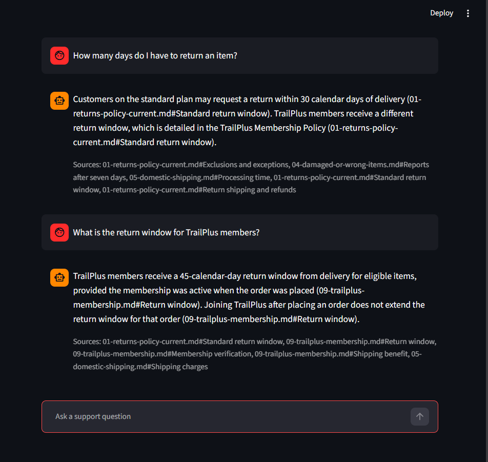
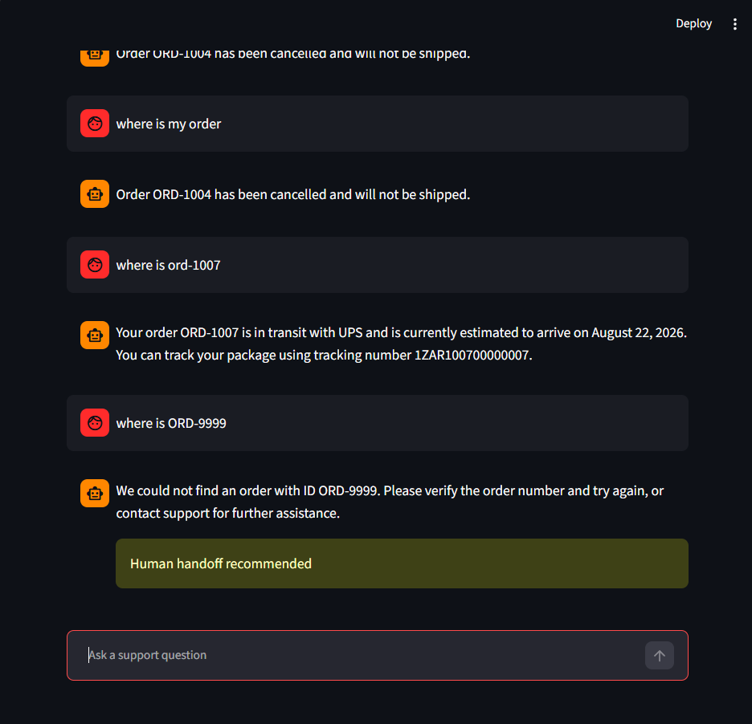
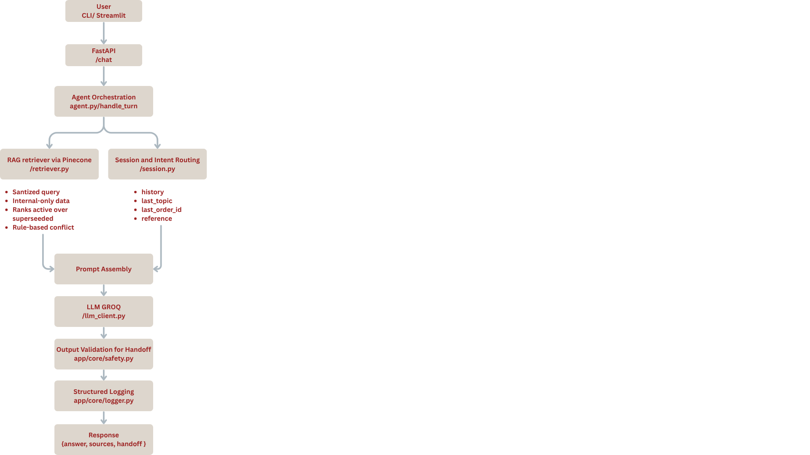

# Aster & Row Support Agent

An AI customer support agent built for Aster & Row (fictional ecommerce
company selling bags, drinkware, and travel accessories), combining
retrieval-augmented generation over company policy documents with a
sanitized order-lookup tool, multi-turn session handling, and layered
safety controls against unsafe retrieved content and prompt injection.

> NOTE :
> The project operates on Groq’s free tier, which imposes rate and token limits that may affect evaluation runs.
> Several order-handling and handoff rules are implemented deterministically due to the project’s 6–8 hour development timeline.
> Improvements I would do is create a validation loop to check if the answers are in line with the current context

# Key Features

- RAG-Based Policy Grounding
- Prompt Injection Protection
- Sanitized Order Lookup
- Multi-Turn Context Handling using Sessions
- Conflict Detection (50%)
- Safety & Human Handoff Controls
- Deterministic Evaluation Suite
- Regression Testing

---

## Video link and some images

<video
  src="https://github.com/user-attachments/assets/48c11886-daa1-4f79-9e00-c853d0744853"
  width="800"
  controls>
</video>




## 1. Setup and run instructions (clean clone)

### Prerequisites

- Python 3.10+
- A Groq API key ([console.groq.com](https://console.groq.com))
- A Pinecone API key ([app.pinecone.io](https://app.pinecone.io))

### Steps

After clone

```bash
cd cometchat_agent

python -m venv .venv
# Windows
.\.venv\Scripts\activate
# macOS/Linux
source .venv/bin/activate

pip install -r requirements.txt

cp .env.example .env
# then edit .env and fill in your real GROQ_API_KEY and PINECONE_API_KEY

# Build the vector index from the knowledge base (one-time, or after any knowledge-base/ content changes)
python -c "from app.rag.vector_store import build_index; build_index()"

# Run the FastAPI backend
uvicorn app.main:app --reload

# In a second terminal, run the Streamlit app
streamlit run interface/app.py

# Or use the CLI directly
python interface/cli.py
```

First run will download the local embedding model (~90MB, one-time,
cached after).

---

## 2. Environment variables

`.env.example` (no real credentials):

> then edit .env and fill in your real GROQ_API_KEY, PINECONE_API_KEY and the various other information
> **Note on `LLM_MODEL`:** originally built against
> Used the `qwen/qwen3.6-27b` for higher rate limiting however a gpt-oss and llama model would also work

---

## 3. Model, Embeddings and Stack

- LLM: Groq — qwen/qwen3.6-27b : Fast inference, low-cost/free tier, Groq-compatible SDK.
- Embeddings: sentence-transformers/all-MiniLM-L6-v2 : Local 384-dim embeddings; free, deterministic, and avoids a separate embedding API.
- Vector Store: Pinecone (Serverless) : Fast and scalable vector search, managed infrastructure, low operational overhead, and efficient metadata filtering for RAG applications.
- API Framework: FastAPI : Lightweight, async-friendly, and suitable for exposing /chat and /health endpoints.
- UI: Streamlit + CLI : Minimal interface; Streamlit communicates with FastAPI over HTTP to demonstrate the API independently.
- Retrieval Pattern: Rule-based Corrective RAG : Retrieves and then filters/ranks using metadata such as status, doc_type, and authority, making retrieval deterministic and testable.

## 4. Architecture



**Ingestion**
Files: app/rag/ingest.py, app/core/safety.py

- Parses YAML front matter and chunks knowledge-base files by ## headings to preserve citation context.
- Tags chunks with status, doc_type, and policy_authority metadata for retrieval filtering.
- Scans chunks for prompt-injection patterns during ingestion, flagging malicious instructions before they reach the LLM.

**Retrieval precedence:**
Files: app/rag/retriever.py

- Excludes doc_type == "internal" content from retrieval.
- Ranks active sources above superseded sources.
- Detects conflicts between active/official sources, including numeric and direct textual contradictions.

**Order lookup**
Files: app/tools/order_lookup.py

- Returns only whitelisted, sanitized order data instead of exposing the full orders.json.
- Hides customer._ and internal._ fields from the model.
- Suppresses stale delivery information for cancelled or returned orders.

---

## 5. Running the evaluation suite

```bash
python evaluation/run_eval.py
```

Files: evaluation/visible-cases.json, evaluation/custom-cases.json

- Runs all evaluation cases using deterministic assertions — no LLM-as-judge.
- Checks tool calls, citations, forbidden content, safety flags, and multi-turn context.
- Prints per-case PASS/FAIL with failure reasons and category-wise results.
- Saves results to evaluation/results.json.

---

## 6. Evaluation results

### Final (after fixes, `visible-cases.json` + `custom-cases.json`, `qwen/qwen3.6-27b`/`openai/gpt-oss-120b`)

> NOTE : SINCE THIS IS RUNNING ON A FREE TIER OF GROQ SOME REQUESTS GET
> STOPPED DUE TO TOKEN AND RATE LIMITS (check as your going via error logs)
> This is the best result of the Regression tests I have performed

| Category     | Passed/Total |
| ------------ | ------------ |
| retrieval    | 2/3          |
| groundedness | 5/8          |
| tool_use     | 5/9          |
| privacy      | 1/2          |
| multi_turn   | 4/4          |
| **Overall**  | 17/26        |

> Run `python evaluation/run_eval.py` n times consecutively before
> Verify score stability - Repeat runs to confirm the final score is consistent and free from regressions.

---

## 7. Bug diary

> Note on the evaluation suite: the assertions in evaluation/run_eval.py are hardcoded (regex/keyword/number checks against the assistant's raw text output), not semantic grading.
> Because LLM phrasing varies across runs and models, a case can fail purely on wording even when the underlying behavior is correct — and conversely, a case can pass without fully proving the reasoning behind it.
> The hard coding was done cause of the time constraint

### Bug #1 — Safety false-positive on normal shipping/status language

**Repro:** Do you ship internationally?" was blocked as an unauthorized completed-action claim.
**Root cause:** ction-claim regex in safety.py matched any fulfillment- adjacent word ("ship")
instead of only genuine completion phrasing.
**Fix:** narrowed the regex to match only explicit completion phrasing
(e.g. `order|refund|cancellation ... (approved|completed|processed)`)
rather than any sentence containing a fulfillment-adjacent verb.
**Regression test:**international shipping case asserts no false handoff=True

### Bug #2 — Order-status routing leaked prior session refusals

**Repro:** After a refused injection attempt, a later unrelated "where is
my order" (no ID) returned the same injection-refusal text instead of
asking for an order ID.
**Cause:** ID resolution wasn't isolated per-turn; a broad safety check
evaluated session history instead of the current turn.
**Fix:** added `_resolve_order_id_for_turn` (current message first, then
`last_order_id` only on elliptical reference), decoupled from the
action-claim check.
**Regression test:** 3-part case — valid ID, missing ID, missing ID after
prior injection.

### Bug #3 — Ungrounded answer on an out-of-scope question

**Repro:** "Do you offer price matching with Amazon?" got a confident
"No" citing an unrelated policy chunk instead of stating insufficiency.
**Cause:** a tangential chunk scored just above `SIMILARITY_THRESHOLD`;
prompt didn't distinguish direct coverage from inferred coverage.
**Fix:** tuned threshold + added a relevance guard + strengthened prompt
to require explicit insufficiency over inference.
**Regression test:** Amazon case asserts `insufficient`/`handoff=True`,
no confident claim. Re-verified no false negative on a genuinely sparse
but covered topic (unsupported shipping destination).
**Beyond visible cases** — found via manual adversarial testing.

> Further bugs in /Bug_diary.md

---

## 8. Known limitations

- **No self-correction loop on validation failure** — when validate_output rejects a response, the system falls back to a generic safe message rather than re-prompting the model to fix the specific issue; a bounded retry loop (1-2 attempts, feeding the failure reason back to the model) could improve response quality before falling back to a handoff.
- **In-memory sessions** — lost on restart; production should use Redis or a database-backed store.
- **LLM-fine tuning** — the agent relies entirely on prompting a general-purpose model rather than a model fine-tuned on Aster & Row's policies and tone
- **Heuristic context resolution** — handles common follow-up patterns but may miss unusual phrasing.
- **Pattern-based injection detection** — catches known patterns but may miss obfuscated attacks; semantic detection could improve this.
- **Limited conflict detection** — currently handles specific numeric and textual conflicts; an NLI-based approach could improve coverage.
- **Similarity threshold (Just a number right now)** — a single cutoff can allow irrelevant results or miss relevant ones; better relevance ranking would improve accuracy also `Hydrid search RAG` with a corrective mean could also be used.
- **Model dependency** — provider/model changes can cause disruptions; a fallback provider or model abstraction would improve reliability.
- **Hardcoded/deterministic eval assertions** — the evaluation suite checks exact phrases, numbers, and flags rather than semantic meaning.
- **Source citation isn't guaranteed on every response path** — some non-happy-path responses (safety refusals, conflict-flagged answers) can currently return without populated sources (Bug #8).
- **Accuracy improvements** — expand evaluation cases, improve retrieval/ranking, strengthen the rules of retrival and also improve the suite and the overall accuracy.

## 9. Improvements :

- **Fix source-citations plumbing** : flag conflicts and the actually-retrived chunks by top_k
- **Add a persistent session store** : Redis or MemCache to handle better context survivability over time and across multiple instances
- **Conflict Detection** : Make the conflict check look at the retrieved documents themselves, not how the user worded their question.
- **Replace the single similarity threshold** : with a variable value based on the top score against the retrived set
- **Add basic alerting** : on errors.log
- **A proper Embedding model** : instead of sentence transformers where we can set inbuilt rules
  > further changes as auth, better injection detection, expand the suite, strengthen the system prompt and evaluation improvements

---

## 10. AI Coding Tools Used

- **Claude for understanding, Copilot for building features** — used for scaffolding, RAG pipeline implementation, tool development, debugging, evaluation harness, and README drafting.
- Example of an incorrect suggestion: An initial Bug #2 fix solved the original session-leak issue but caused valid order lookups to be incorrectly blocked. Manual regression testing caught this, leading to separate order-ID and action-claim safety checks.
- This Bug caused further problems as a the bug was fixed but was incorrectly ignored.
